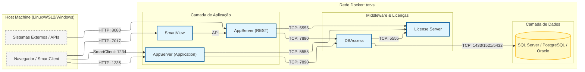

# Dockerização do ERP TOTVS Protheus

## Overview

Este repositório contém a implementação da aplicação do ERP TOTVS Protheus utilizando uma arquitetura de microserviços em containers Docker.

O sistema de ERP Protheus é uma solução de software complexa que requer configurações e dependências específicas. Este projeto visa simplificar drasticamente a instalação, configuração e execução do Protheus para **ambientes de desenvolvimento e teste**.

---

## Aviso Legal e Instruções de Uso

Este repositório é um projeto independente e não possui qualquer afiliação com a TOTVS S/A. O código e as imagens aqui disponibilizados são destinados **exclusivamente para fins de desenvolvimento e testes**. **Não utilize este projeto em ambiente de produção.**

---

## 🚀 Ferramentas de Apoio (Recomendado)

*   **[TOTVS Protheus Compose Generator](https://juliansantosinfo.github.io/TOTVS-Protheus-Compose-Generator/):** Configure seu ambiente visualmente e baixe o `docker-compose.yml` e `.env` customizados.
*   **[TOTVS Protheus Dockerfile Generator](https://juliansantosinfo.github.io/TOTVS-Protheus-Dockerfile-Generator/):** Gere Dockerfiles customizados para builds específicos.

---

## Branchs disponíveis

* [**Release 12.1.2310**](https://github.com/juliansantosinfo/TOTVS-Protheus-in-Docker/tree/12.1.2310)
* [**Release 12.1.2410**](https://github.com/juliansantosinfo/TOTVS-Protheus-in-Docker/tree/12.1.2410)
* [**Release 12.1.2510**](https://github.com/juliansantosinfo/TOTVS-Protheus-in-Docker/tree/12.1.2510)

## 🏗️ Arquitetura e Componentes

A arquitetura do projeto é baseada em distribuições **Enterprise Linux** (como **Red Hat UBI** ou **Oracle Linux**), garantindo segurança, estabilidade e conformidade corporativa em todos os microserviços.

O projeto é dividido nos seguintes serviços:

1.  **`appserver`**: O servidor de aplicação Protheus (Base: RHEL/Oracle Linux). Esta é uma imagem otimizada e versátil que pode operar em três modos:
    *   `application` (padrão): Executa o servidor de aplicação principal (SmartClient Web/TCP).
    *   `rest`: Executa o servidor dedicado para a API REST.
    *   `sqlite`: Executa como servidor de arquivos locais (LocalFiles) para alta performance.
    *   *Nota: O servidor web de gerenciamento legado em Python foi removido para maior segurança e leveza.*
2.  **`dbaccess`**: Middleware de acesso ao banco de dados (Base: RHEL/Oracle Linux), com suporte a setup dinâmico de drivers ODBC.
3.  **`licenseserver`**: Gestão de licenças TOTVS (Base: RHEL/Oracle Linux).
4.  **`smartview`**: Servidor de BI e Analytics (Base: RHEL/Oracle Linux com suporte gráfico EPEL).
5.  **Banco de Dados**: Suporte nativo a **Microsoft SQL Server**, **PostgreSQL** e **Oracle Database**.

### ⚙️ Gestão de Versões (Centralizada)

O projeto utiliza o arquivo `versions.env` na raiz como **fonte única de verdade** para todas as versões de componentes e tags de imagem. 

Ao alterar uma versão, o script `./scripts/validation/versions.sh --fix` sincroniza automaticamente todos os Dockerfiles e scripts. Os scripts mestres de automação dependem estritamente desse arquivo para garantir builds consistentes.

---

### Fluxo de Comunicação

O diagrama abaixo ilustra como os serviços interagem dentro da rede Docker e como são acessados externamente:


```mermaid
---
config:
  layout: elk
---
flowchart LR
 subgraph Host["Host Machine (Linux/WSL2/Windows)"]
        Browser["Navegador / SmartClient"]
        ExternalAPI["Sistemas Externos / APIs"]
  end
 subgraph Databases["Camada de Dados"]
        DB[("SQL Server / PostgreSQL / Oracle")]
  end
 subgraph Middleware["Middleware & Licenças"]
        DBA["DBAccess"]
        LIC["License Server"]
  end
 subgraph Application["Camada de Aplicação"]
        APP["AppServer (Application)"]
        REST["AppServer (REST)"]
        SmartView["SmartView"]
  end
 subgraph DockerNetwork["Rede Docker: totvs"]
        Databases
        Middleware
        Application
  end
    Browser -- HTTP: 1235 --> APP
    Browser -- SmartClient: 1234 --> APP
    Browser -- HTTP: 7017 --> SmartView
    ExternalAPI -- HTTP: 8080 --> REST
    APP -- TCP: 7890 --> DBA
    REST -- TCP: 7890 --> DBA
    SmartView -- API --> REST
    APP -- TCP: 5555 --> LIC
    REST -- TCP: 5555 --> LIC
    DBA -- TCP: 5555 --> LIC
    DBA -- TCP: 1433/1521/5432 --> DB

     Browser:::host
     ExternalAPI:::host
     DB:::db
     DBA:::container
     LIC:::container
     APP:::container
     REST:::container
     SmartView:::container
    classDef container fill:#e1f5fe,stroke:#01579b,stroke-width:2px
    classDef db fill:#fff9c4,stroke:#fbc02d,stroke-width:2px
    classDef host fill:#f5f5f5,stroke:#9e9e9e,stroke-width:2px,stroke-dasharray: 5 5
```

---

## Requisitos de Sistema

Certifique-se de ter os seguintes pré-requisitos instalados em seu sistema:

*   **Linux (Recomendado):** Docker Engine e Docker Compose v2.
*   **Windows:** WSL2 (Obrigatório) + Docker Desktop configurado para o backend WSL2.
*   **Mac:** Docker Desktop (Intel ou Apple Silicon via Rosetta).

> **Aviso de Performance:** No Windows/WSL2, mantenha os arquivos do projeto dentro do sistema de arquivos do Linux (`/home/...`) para evitar lentidão extrema de I/O.

---

## Início Rápido

Você pode configurar o ambiente de duas formas: utilizando o gerador web (mais fácil) ou manualmente seguindo os passos abaixo.

### Opção 1: Usando o Gerador (Recomendado)

1. Acesse o [**TOTVS Protheus Compose Generator**](https://juliansantosinfo.github.io/TOTVS-Protheus-Compose-Generator/).
2. Selecione as opções desejadas.
3. Baixe os arquivos `docker-compose.yml` e `.env`.
4. Em um terminal, na pasta onde baixou os arquivos, execute:
   ```bash
   docker compose up -d
   ```

### Opção 2: Manual (Recomendada para Devs)

1.  Clone este repositório:
    ```bash
    git clone https://github.com/juliansantosinfo/TOTVS-Protheus-in-Docker.git
    cd TOTVS-Protheus-in-Docker
    ```

2.  Instale os Git Hooks e prepare o ambiente:
    ```bash
    ./scripts/hooks/install.sh
    ./scripts/build/setup.sh
    ```

3.  Configure as variáveis de ambiente. Copie o arquivo de exemplo `.env.example` para `.env` e ajuste as variáveis conforme necessário, como a senha do banco de dados.:
    ```bash
    cp .env.example .env
    ```

4.  Inicie os contêineres usando Docker Compose. Escolha o comando de acordo com o banco de dados desejado:

    *   **Para usar PostgreSQL (Recomendado):**
        ```bash
        docker compose -f docker-compose-postgresql.yaml -p totvs up -d
        ```

    *   **Para usar Microsoft SQL Server:**
        ```bash
        docker compose -f docker-compose-mssql.yaml -p totvs up -d
        ```

    *   **Para usar Oracle Database:**
        ```bash
        docker compose -f docker-compose-oracle.yaml -p totvs up -d
        ```

---

## 📦 Build Local e Automação

O projeto conta com scripts robustos no diretório `scripts/` para facilitar todo o ciclo de vida do ecossistema, permitindo a orquestração de múltiplos submodulos simultaneamente.

### Scripts Mestres

A partir da raiz do projeto, você pode gerenciar todos os serviços de forma unificada:

| Script | Função |
|---|---|
| `./scripts/build/setup.sh [apps...]` | Baixa binários e recursos pré-configurados. Essencial antes do primeiro build. |
| `./scripts/build/build.sh [apps...]` | Realiza o build de imagens localmente. |
| `./scripts/build/clean.sh [apps...]` | Remove arquivos não versionados e temporários, garantindo um ambiente limpo. |
| `./scripts/build/push.sh [apps...]` | Envia as imagens construídas para o Docker Hub. |

> **Dica de Uso:** Todos os scripts mestres aceitam de forma opcional os nomes dos serviços (ex: `appserver dbaccess`). Se nenhum argumento for passado, o script processará **todos** os submodulos disponíveis. Eles também repassam parâmetros extras para os scripts individuais (ex: `./scripts/build/build.sh appserver --no-cache`).

### Outros Utilitários

| Script | Função |
|---|---|
| `./scripts/validation/versions.sh` | Valida a consistência de versões e labels baseado no `versions.env`. |
| `./scripts/test/test-compose.sh` | Valida se os arquivos compose estão sintaticamente corretos e executam um smoke test. |

### 💡 Perfis de Inicialização (Profiles)

Os serviços opcionais **AppRest** (servidor REST) e **SmartView** (BI/Analytics) podem ser iniciados usando perfis do Docker Compose.

#### Perfis Disponíveis:

| Perfil | Serviços Incluídos | Descrição |
|--------|-------------------|-----------|
| *(padrão)* | `postgres/mssql/oracle`, `licenseserver`, `dbaccess`, `appserver` | Stack básica para uso com SmartClient |
| `full` | Stack básica + `apprest` + `smartview` | Stack completa com todos os serviços |
| `with-rest` | Stack básica + `apprest` | Adiciona apenas o servidor REST/API |
| `with-smartview` | Stack básica + `smartview` | Adiciona apenas o servidor de BI |

#### Exemplos de Uso:

**Stack básica (sem perfil):**
```bash
docker compose -f docker-compose-postgresql.yaml -p totvs up -d
```

**Stack completa (REST + SmartView):**
```bash
docker compose -f docker-compose-postgresql.yaml --profile full -p totvs up -d
```

**Apenas com REST:**
```bash
docker compose -f docker-compose-postgresql.yaml --profile with-rest -p totvs up -d
```

**Apenas com SmartView:**
```bash
docker compose -f docker-compose-postgresql.yaml --profile with-smartview -p totvs up -d
```

**Múltiplos perfis (REST + SmartView separadamente):**
```bash
docker compose -f docker-compose-postgresql.yaml --profile with-rest --profile with-smartview -p totvs up -d
```

> **Nota:** Os perfis funcionam da mesma forma para todos os bancos de dados (PostgreSQL, MSSQL e Oracle).

4.  Acesse a aplicação:
    *   **Smartclient Web:** Abra seu navegador e acesse <http://localhost:1235>
    *   **Credenciais:**
        *   **Usuário:** `admin`
        *   **Senha:** ` ` *(1 Espaço em branco)*

---

## 📦 Persistência e Volumes

O projeto utiliza volumes nomeados para garantir a persistência dos dados e facilitar a customização:

| Volume | Descrição |
|---|---|
| `totvs_protheus_data` | Dados do Protheus (`protheus_data`). **Essencial.** |
| `totvs_appserver_apo` | Repositório de Objetos (`APO`). Use para mapear seu `custom.rpo`. |
| `totvs_postgres_data` / `totvs_mssql_data` | Dados brutos do banco de dados. |

---

## Build Local das Imagens

Se preferir construir as imagens Docker localmente em vez de usar as do Docker Hub:

1.  Clone o repositório, caso ainda não o tenha feito.
2.  Execute o script `build.sh` dentro do diretório de cada componente:
    ```bash
    # Construir a imagem do AppServer (que serve para 'application' e 'rest')
    cd services/appserver/
    ./build.sh
    cd ../..

    # Construir a imagem do DBAccess
    cd services/dbaccess/
    ./build.sh
    cd ../..

    # Construir a imagem do License Server
    cd services/licenseserver/
    ./build.sh
    cd ../..

    # Construir a imagem do MS SQL (se for usar)
    cd services/mssql/
    ./build.sh
    cd ../..

    # Construir a imagem do PostgreSQL (se for usar)
    cd services/postgres/
    ./build.sh
    cd ../..

    # Construir a imagem do Oracle (se for usar)
    cd services/oracle/
    ./build.sh
    cd ../..
    ```

> **Nota:** É altamente recomendado utilizar os scripts mestres (`./scripts/build/build.sh`) na raiz do projeto em vez de acessar os diretórios individualmente, pois eles garantem o contexto e automação consistentes.

3.  Após construir as imagens, suba os contêineres com os comandos do "Início Rápido".

---

## 🚀 CI/CD e GitHub Actions

O projeto possui um fluxo rigoroso de Integração e Entrega Contínuas (CI/CD) utilizando o GitHub Actions, definido em `.github/workflows/deploy.yml`.

### Fluxo Automatizado
O workflow é acionado automaticamente em eventos de `push` e `pull_request` nas branches principais (`main`, `master`, `12.1.*`), ignorando corretamente edições em documentações e configurações locais para otimizar os runners.

Ele executa três jobs principais:
1. **Lint e Validação**: Verifica sintaxe de Dockerfiles (Hadolint), Shell Scripts (ShellCheck), consistência de variáveis (`versions.env`) e validação de Compose.
2. **Smoke Test**: Executa o download de binários (`setup.sh`), build das imagens e sobe todos os perfis do Docker Compose (`postgres`, `mssql`, `oracle`) para garantir que os serviços se comunicam sem erros.
3. **Build e Push**: Se o ambiente for válido e estiver rodando em uma branch principal (não-PR), realiza o build e envia as imagens multi-plataforma para o Docker Hub, com as tags apropriadas baseadas no `versions.env` e controle de label `latest`.

### Gatilho Manual (Workflow Dispatch)
O fluxo oferece um controle granular via *Workflow Dispatch*. Pela interface do GitHub Actions, você pode, de forma seletiva:
- Escolher fazer o build/push de **todos** os serviços simultaneamente.
- Selecionar o nome de um serviço específico para interagir (ex: `appserver` ou `smartview`), acelerando builds seletivos em releases menores.

---

## Configuração

A configuração dos serviços é feita principalmente por meio de **variáveis de ambiente**. Os arquivos `docker-compose-*.yaml` contêm as configurações padrão.

Os `Dockerfiles` para cada componente estão em seus respectivos diretórios (`services/appserver/Dockerfile`, `services/dbaccess/Dockerfile`, etc.).

## Execução Manual dos Containers

Para executar cada contêiner individualmente (sem Docker Compose), siga os passos:

1.  **Crie a Rede Docker:**
    ```bash
    docker network create totvs
    ```

2.  **Inicie os Contêineres:**
    *   **Banco de Dados (Exemplo com MSSQL):**
        ```bash
        docker run -d --name totvs_mssql --network totvs -p 1433:1433 -e "ACCEPT_EULA=Y" -e "SA_PASSWORD=ProtheusDatabasePassword1" juliansantosinfo/totvs_mssql:latest
        ```
    *   **License Server:**
        ```bash
        docker run -d --name totvs_licenseserver --network totvs -p 5555:5555 -p 2234:2234 -p 8020:8020 juliansantosinfo/totvs_licenseserver:latest
        ```
    *   **DBAccess:**
        ```bash
        docker run -d --name totvs_dbaccess --network totvs -p 7890:7890 -e "DATABASE_SERVER=totvs_mssql" -e "DATABASE_PASSWORD=ProtheusDatabasePassword1" juliansantosinfo/totvs_dbaccess:latest
        ```
    *   **AppServer (Modo Aplicação):**
        ```bash
        docker run -d --name totvs_appserver --network totvs -p 1234:1234 -p 1235:1235 -e "APPSERVER_MODE=application" juliansantosinfo/totvs_appserver:latest
        ```
    *   **AppServer (Modo REST):**
        ```bash
        docker run -d --name totvs_apprest --network totvs -p 8080:8080 -e "APPSERVER_MODE=rest" juliansantosinfo/totvs_appserver:latest
        ```
    *   **SmartView:**
        ```bash
        docker run -d --name totvs_smartview --network totvs -p 7017:7017 -p 7019:7019 juliansantosinfo/totvs_smartview:latest
        ```

---

## Perguntas Frequentes (FAQ)

**P:** Ao iniciar os containers, recebo o erro `[ERROR][SERVER] OPERATIONAL LIMITS ARE INSUFFICIENT, CHECK THE INSTALLATION PROCEDURES AS WELL AS 'ULIMIT' CONFIGURATION`. Como corrigir?

**R:** Este erro ocorre quando o limite de arquivos abertos no sistema host é muito alto, causando uma interpretação incorreta pelo contêiner. Para corrigir, ajuste o limite no seu sistema host (especialmente em ambientes WSL2/Linux):

1.  Verifique o limite atual: `cat /proc/sys/fs/file-max`
2.  Se o valor for excessivamente alto, ajuste-o temporariamente: `sudo sysctl -w fs.file-max=65535`
3.  Para tornar a alteração permanente, adicione `fs.file-max = 65535` ao arquivo `/etc/sysctl.conf` e execute `sudo sysctl -p`.

---

## Variáveis de Ambiente

Abaixo estão as principais variáveis para configurar os serviços.

#### Banco de Dados: `mssql`

| Variável | Descrição | Padrão |
|---|---|---|
| `SA_PASSWORD` | Senha para o usuário `sa` (usar `DATABASE_PASSWORD` do `.env`). | `ProtheusDatabasePassword1` |
| `ACCEPT_EULA` | Confirma a aceitação da licença de uso do SQL Server. | `Y` |
| `RESTORE_BACKUP` | Define se o backup inicial deve ser restaurado (`Y`/`N`). | `Y` |
| `DEBUG_SCRIPT` | Ativa o modo de depuração dos scripts (`true`/`false`). | `false` |
| `TZ` | Fuso horário do contêiner. | `America/Sao_Paulo` |

#### Banco de Dados: `postgres`

| Variável | Descrição | Padrão |
|---|---|---|
| `POSTGRES_USER` | Nome do superusuário do banco de dados. | `postgres` |
| `POSTGRES_PASSWORD`| Senha para o superusuário (usar `DATABASE_PASSWORD` do `.env`). | `ProtheusDatabasePassword1` |
| `POSTGRES_DB` | Nome do banco de dados a ser criado na inicialização. | `protheus` |
| `POSTGRES_INITDB_ARGS`| Argumentos extras para o `initdb`, como `locale`. | `--locale=pt_BR.ISO-8859-1 -E LATIN1` |
| `RESTORE_BACKUP` | Define se o backup inicial deve ser restaurado (`Y`/`N`). | `Y` |
| `DEBUG_SCRIPT` | Ativa o modo de depuração dos scripts (`true`/`false`). | `false` |
| `TZ` | Fuso horário do contêiner. | `America/Sao_Paulo` |

#### Banco de Dados: `oracle`

| Variável | Descrição | Padrão |
|---|---|---|
| `ORACLE_PWD` | Senha para os usuários `SYS`, `SYSTEM` e `PDBADMIN`. | `ProtheusDatabasePassword1` |
| `RESTORE_BACKUP` | Define se o backup inicial deve ser restaurado (`Y`/`N`). | `Y` |
| `DEBUG_SCRIPT` | Ativa o modo de depuração dos scripts (`true`/`false`). | `false` |
| `TZ` | Fuso horário do contêiner. | `America/Sao_Paulo` |

#### `licenseserver`

| Variável | Descrição | Padrão |
|---|---|---|
| `LICENSE_TCP_PORT` | Porta TCP de comunicação. | `2234` |
| `LICENSE_PORT` | Porta principal do serviço. | `5555` |
| `LICENSE_WEBAPP_PORT`| Porta da interface web de monitoramento. | `8020` |
| `LICENSE_CONSOLEFILE`| Caminho do arquivo de log do serviço. | `/totvs/licenseserver/bin/appserver/licenseserver.log` |
| `DEBUG_SCRIPT` | Ativa o modo de depuração dos scripts (`true`/`false`). | `false` |
| `TZ` | Fuso horário do contêiner. | `America/Sao_Paulo` |

#### `dbaccess`

| Variável | Descrição | Padrão |
|---|---|---|
| `DATABASE_PROFILE` | Tipo do banco de dados (`POSTGRES`, `MSSQL` ou `ORACLE`). | `MSSQL` |
| `DATABASE_SERVER` | Host do servidor de banco de dados. | `totvs_mssql` / `totvs_postgres` / `totvs_oracle` |
| `DATABASE_PORT` | Porta do servidor de banco de dados. | `1433` / `5432` / `1521` |
| `DATABASE_ALIAS` | Alias da base de dados no DBAccess. | `protheus` |
| `DATABASE_NAME` | Nome da base de dados. | `protheus` |
| `DATABASE_USERNAME` | Usuário de acesso ao banco. | `sa` / `postgres` / `system` |
| `DATABASE_PASSWORD` | Senha de acesso ao banco (usar `DATABASE_PASSWORD` do `.env`). | `ProtheusDatabasePassword1` |
| `DATABASE_WAIT_RETRIES` | Número de tentativas de conexão com o banco. | `30` |
| `DATABASE_WAIT_INTERVAL` | Intervalo em segundos entre tentativas de banco. | `2` |
| `DBACCESS_LICENSE_SERVER`| Host do License Server. | `totvs_licenseserver` |
| `DBACCESS_LICENSE_PORT`| Porta do License Server. | `5555` |
| `LICENSE_WAIT_RETRIES` | Número de tentativas de conexão com o License Server. | `30` |
| `LICENSE_WAIT_INTERVAL` | Intervalo em segundos entre tentativas de licença. | `2` |
| `DEBUG_SCRIPT` | Ativa o modo de depuração dos scripts (`true`/`false`). | `false` |
| `DBACCESS_CONSOLEFILE`| Caminho do arquivo de log do serviço. | `/totvs/dbaccess/multi/dbconsole.log` |
| `TZ` | Fuso horário do contêiner. | `America/Sao_Paulo` |

#### `appserver` / `apprest`

| Variável | Descrição | Padrão |
|---|---|---|
| `APPSERVER_MODE` | Modo de operação: `application` ou `rest`. | `application` |
| `APPSERVER_DBACCESS_DATABASE` | Tipo do banco de dados (`POSTGRES`, `MSSQL` ou `ORACLE`). | `MSSQL` |
| `APPSERVER_DBACCESS_SERVER` | Host do serviço DBAccess. | `totvs_dbaccess` |
| `APPSERVER_DBACCESS_PORT` | Porta do serviço DBAccess. | `7890` |
| `APPSERVER_DBACCESS_ALIAS` | Alias da conexão com o banco. | `protheus` |
| `APPSERVER_LICENSE_SERVER` | Host do License Server. | `totvs_licenseserver` |
| `APPSERVER_LICENSE_PORT` | Porta do License Server. | `5555` |
| `APPSERVER_PORT` | Porta principal do AppServer (modo `application`). | `1234` |
| `APPSERVER_WEB_PORT` | Porta da interface web/Smartclient (modo `application`). | `1235` |
| `APPSERVER_REST_PORT` | Porta do serviço REST (modo `rest`). | `8080` |
| `APPSERVER_CONSOLEFILE`| Caminho do arquivo de log do serviço. | `/totvs/protheus/bin/appserver/appserver.log` |
| `APPSERVER_RPO_CUSTOM` | Caminho para o RPO customizado. | `/totvs/protheus/apo/custom.rpo` |
| `APPSERVER_ENVIRONMENT_LOCALFILES`| Tipo de banco para arquivos locais (`SQLite`). | `SQLITE` |
| `APPSERVER_SQLITE_SERVER`| Host do serviço de banco de dados local. | `totvs_appsqlite` |
| `APPSERVER_SQLITE_PORT`| Porta do serviço de banco de dados local. | `12346` |
| `APPSERVER_SQLITE_INSTANCES`| Configuração de instâncias do `SQLite`. | `1,10,1,1` |
| `APPSERVER_MULTIPROTOCOLPORTSECURE`| Porta segura para múltiplos protocolos (0 para desativar). | `0` |
| `APPSERVER_MULTIPROTOCOLPORT`| Porta para múltiplos protocolos. | `1` |
| `LICENSE_WAIT_RETRIES` | Número de tentativas de conexão com o License Server. | `30` |
| `LICENSE_WAIT_INTERVAL` | Intervalo em segundos entre tentativas. | `2` |
| `DBACCESS_WAIT_RETRIES` | Número de tentativas de conexão com o DBAccess. | `30` |
| `DBACCESS_WAIT_INTERVAL` | Intervalo em segundos entre tentativas. | `2` |
| `EXTRACT_RESOURCES`| Extrai `protheus.tar.gz` na inicialização (`true`/`false`). | `true` |
| `DEBUG_SCRIPT` | Ativa o modo de depuração dos scripts (`true`/`false`). | `false` |
| `TZ` | Fuso horário do contêiner. | `America/Sao_Paulo` |

#### `smartview`

| Variável | Descrição | Padrão |
|---|---|---|
| `EXTRACT_RESOURCES` | Extrai `smartview.tar.gz` na inicialização (`true`/`false`). | `true` |
| `DEBUG_SCRIPT` | Ativa o modo de depuração dos scripts (`true`/`false`). | `false` |
| `TZ` | Fuso horário do contêiner. | `America/Sao_Paulo` |

---

### Licença

Este projeto está licenciado sob a Licença MIT. Consulte o arquivo `LICENSE.txt` para detalhes.

### Contribuindo

Contribuições são bem-vindas! Sinta-se à vontade para forcar o projeto e enviar um Pull Request com suas melhorias.