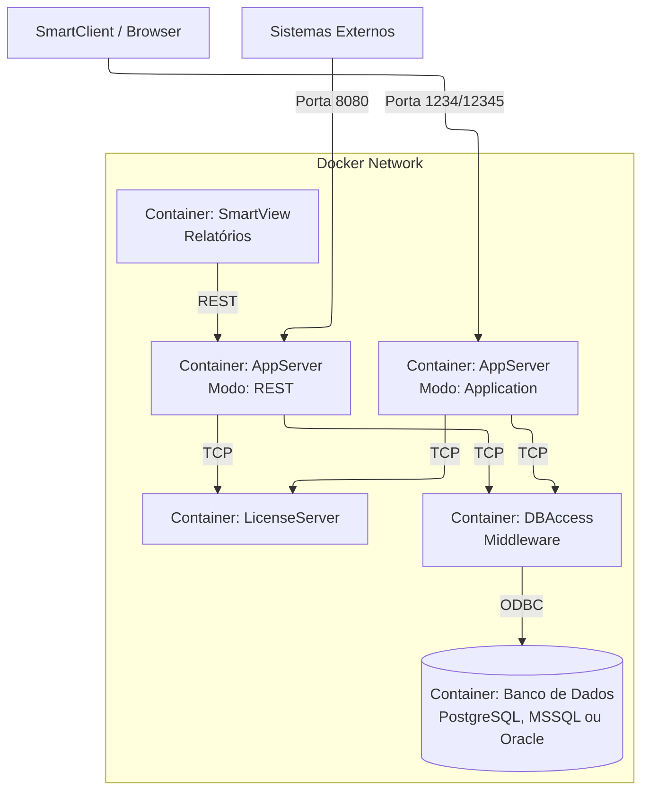

# 2. Arquitetura do Sistema

## 2.1. Conceito de Microserviços Aplicado ao Protheus
Tradicionalmente, uma instalação Protheus envolve um servidor Windows ou Linux pesado rodando múltiplos serviços (DBAccess, AppServer, License Server) e um banco de dados, muitas vezes na mesma máquina.

Neste projeto, explodimos esse monólito em containers discretos, cada um com uma Responsabilidade Única (SRP).

### Diagrama Conceitual

## 2.2. Detalhamento dos Componentes

### 2.2.1. Serviço de Banco de Dados (Database Layer)
O alicerce do sistema. O projeto suporta nativamente três "sabores" de banco de dados, definidos através de arquivos Compose distintos.

*   **Opção A: PostgreSQL (Recomendado)**
    *   **Imagem Base:** `postgres:15`
    *   **Função:** Armazenar os dados do ERP (tabelas, dicionários SXs).
    *   **Particularidades:** O Dockerfile customizado configura o `locale` (pt_BR) e encoding (LATIN1) essenciais para o correto funcionamento do Protheus com acentuação.
    *   **Persistência:** Utiliza volumes Docker para garantir que os dados sobrevivam ao reinício do container.

*   **Opção B: Microsoft SQL Server (MSSQL)**
    *   **Imagem Base:** `mcr.microsoft.com/mssql/server:2019-latest`
    *   **Função:** Alternativa robusta e tradicional para ambientes que espelham produção Windows.
    *   **Particularidades:** Exige aceitação de EULA. O script de inicialização é capaz de restaurar backups `.bak` automaticamente.

*   **Opção C: Oracle Database (XE/Free)**
    *   **Imagem Base:** `gvenzl/oracle-xe:21-slim`
    *   **Função:** Suporte para ambientes que utilizam a tecnologia Oracle.
    *   **Particularidades:** Configuração automatizada de usuário e schema Protheus no boot.

### 2.2.2. Middleware de Banco de Dados (DBAccess)
*   **Imagem:** `totvs_dbaccess`
*   **Função:** Atua como tradutor entre o AppServer (código ADVPL) e o Banco de Dados (SQL).
*   **Inteligência de Inicialização:**
    *   **Wait-for-Network:** O container agora possui mecanismos nativos de retentativa para aguardar a disponibilidade TCP do Banco de Dados e do License Server antes de iniciar, evitando falhas em cascata durante o boot frio da stack.
*   **Configuração Dinâmica:**
    *   No boot, o script `entrypoint.sh` detecta qual banco está sendo usado (Postgres, MSSQL ou Oracle) através de variáveis de ambiente.
    *   Ele configura automaticamente os drivers ODBC (`odbc.ini`), o gerenciador de drivers (`odbcinst.ini`) e o arquivo de configuração do serviço (`dbaccess.ini`).
    *   Isso permite que a **mesma imagem Docker** sirva para conectar em qualquer banco suportado.

### 2.2.3. Servidor de Licenças (License Server)
*   **Imagem:** `totvs_licenseserver`
*   **Função:** Controla as sessões de usuário e permissões de módulos.
*   **Operação:** Emula um servidor de licenças local ou conecta-se a um servidor corporativo virtual (caso configurado). Para ambientes de desenvolvimento, geralmente opera em modo de demonstração ou com licenças de desenvolvedor.

### 2.2.4. Servidor de Aplicação (AppServer)
Este é o coração do processamento. O projeto utiliza uma abordagem inteligente onde uma única imagem Docker (`totvs_appserver`) pode assumir papéis diferentes baseada na variável `APPSERVER_MODE`.

*   **Papel 1: Application Server (Standard)**
    *   **Modo:** `application`
    *   **Portas:** 1234 (TCP SmartClient), 12345 (Web SmartClient).
    *   **Uso:** É onde os usuários se conectam para operar o sistema. Executa as interfaces de tela, rotinas de cadastro, processos, etc.
    
*   **Papel 2: REST Server**
    *   **Modo:** `rest`
    *   **Portas:** 8080 (HTTP REST).
    *   **Uso:** Dedicado a servir APIs para integrações e para o SmartView. Separar este serviço garante que cargas pesadas de API não travem a interface do usuário.

*   **Papel 3: SQLite Server (Local Database)**
    *   **Modo:** `sqlite`
    *   **Portas:** 12346
    *   **Uso:** Utilizado para servir arquivos locais. Utiliza o sqlite no modelo client/server semelhante ao c-tree server.
    

### 2.2.5. SmartView (TReports)
*   **Imagem:** `totvs_smartview`
*   **Função:** Servidor de relatórios modernos da TOTVS.
*   **Integração:** Conecta-se exclusivamente ao AppServer em modo REST para extrair dados e definições de relatórios.

## 2.3. Rede e Comunicação
Todos os containers são colocados em uma rede virtual Docker privada (`totvs`).
*   **Comunicação Interna:** Os containers conversam entre si usando seus nomes de serviço como DNS (ex: o AppServer conecta no `dbaccess` usando o hostname `dbaccess`, não IP).
*   **Exposição Externa:** Apenas as portas necessárias para o usuário (ex: 12345 para Web, 1433 para SQL Management Studio) são mapeadas para o `localhost` da máquina hospedeira.

## 2.4. Volumes e Persistência de Dados
O Docker é efêmero por natureza (arquivos somem se o container for deletado). Para evitar perda de dados, utilizamos Volumes Docker:

*   **`postgres_data` / `mssql_data` / `oracle_data`:** Garante que o banco de dados não seja apagado.
*   **`protheus_data`:** Armazena o `protheus_data` para que atualizações persistam ou possam ser gerenciadas externamente.
*   **`appserver_apo`**: Persiste o Repositório de Objetos (RPO).
*   **`appserver_data`**: Persiste a pasta do binário do servidor de aplicação.
*   **`apprest_apo`**: Persiste o RPO específico para o serviço REST.
*   **`apprest_data`**: Persiste a pasta do binário do serviço REST.
*   **`smartview_data`**: Persiste as configurações e metadados do servidor de relatórios SmartView.

## 2.5. Estratégia de Distribuição de Recursos (Data Pre-loading)
Uma das maiores inovações deste projeto é a estratégia de **Pré-carregamento de Dados**. Em vez de rodar assistentes de instalação (wizards) que consomem horas compilando dicionários e criando tabelas, as imagens Docker são construídas a partir de artefatos ("snapshots") prontos para uso.

### Estrutura dos Pacotes de Recursos
Os arquivos baixados pelo `setup.sh` não são instaladores, mas sim sistemas de arquivos compactados (`.tar.gz`) que são extraídos diretamente para dentro dos containers ou volumes.

#### 1. AppServer (`appserver/totvs/`)
A aplicação é dividida em dois pacotes distintos para separar o que é "estático" (binários) do que é "variável" (dados do sistema).
*   **`protheus.tar.gz` (Stateless):** Contém exclusivamente os binários de execução (`appsrvlinux`, bibliotecas `.so`), certificados e configurações base (`appserver.ini`). Este pacote é imutável durante a operação.
*   **`protheus_data.tar.gz` (Stateful):** Contém a estrutura de dados do sistema ERP:
    *   `system/`: Arquivos de controle de concorrência e numeração (`*.xnu`, semáforos).
    *   `systemload/`: Dicionários de dados e arquivos de help.
    *   `data/`: Logs e arquivos temporários.
    *   *Nota:* Esta separação facilita a persistência, pois o diretório `protheus_data` é o candidato ideal para ser montado em um volume.

#### 2. Bancos de Dados (`mssql/resources/`, `postgres/resources/` e `oracle/resources/`)
Para garantir que o Protheus inicie "pronto para logar" (`admin/admin`), os containers de banco de dados não rodam scripts SQL (`CREATE TABLE...`). Eles restauram uma estrutura física de banco já existente.
*   **`data.tar.gz`**: Contém os arquivos de dados físicos do banco (`.mdf/.ldf` para MSSQL, o diretório `PGDATA` completo para PostgreSQL ou o diretório `oradata` completo para Oracle).
*   **Vantagem:** O tempo de inicialização do banco cai de horas (criação de milhares de tabelas do ERP) para segundos (apenas o start do serviço de banco).

#### 3. SmartView (`smartview/totvs/`)
*   **`smartview.tar.gz`**: Contém a aplicação .NET Core completa e autocontida (DLLs, executável `smartview`). Por ser uma aplicação moderna e autocontida, não exige a mesma complexidade de separação de pastas do AppServer legado.

