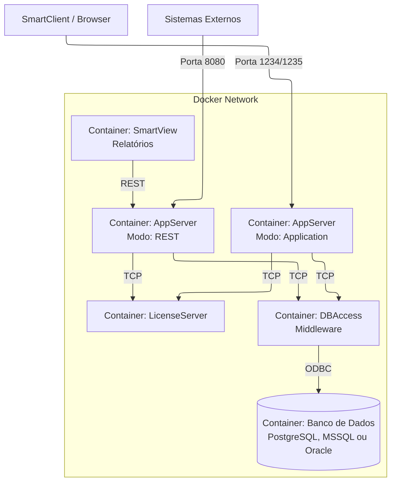

# 2. Arquitetura do Sistema

## 2.1. Arquitetura Orientada a Submódulos Git
A grande inovação da versão 2.0 (comparada com as origens do projeto) é a transição de um repositório monolítico ("mono-repo") para uma **arquitetura de Multi-repositórios Integrados via Git Submodules**.

Nesta abordagem, o repositório principal `TOTVS-Protheus-in-Docker` funciona exclusivamente como um **Maestro**. Ele contém:
1.  Scripts mestres de orquestração (`scripts/build/*`).
2.  A única fonte de verdade para as versões (`versions.env`).
3.  As esteiras automatizadas de CI/CD (`.github/workflows`).
4.  Os perfis de implantação do Docker Compose.

O código-fonte de cada microserviço em particular (como seus `dockerfiles` e `entrypoints` shell) reside em repositórios próprios hospedados no GitHub (ex:`juliansantosinfo/TOTVS-Protheus-in-Docker-AppServer`).

### Diagrama Estrutural (Git)
```mermaid
---
config:
  layout: elk
---
flowchart TD
    Root[Repositório Principal<br>TOTVS-Protheus-in-Docker]
    AppSrv[Submódulo<br>AppServer]
    DBAcc[Submódulo<br>DbAccess]
    LicSrv[Submódulo<br>LicenseServer]
    Dbs[Submódulos<br>Bancos de Dados]

    Root -->|.gitmodules (SSH)| AppSrv
    Root -->|.gitmodules (SSH)| DBAcc
    Root -->|.gitmodules (SSH)| LicSrv
    Root -->|.gitmodules (SSH)| Dbs
```

**Benefício Colateral:** Esta separação permite que você construa pipelines isolados para testar um commit no banco de dados isoladamente antes de integrá-lo ao ecossistema principal.

## 2.2. A "Fonte a Única de Verdade" (`versions.env`)
No centro da arquitetura modular reside o arquivo `versions.env`. Sua premissa é simples, mas poderosa: **Nenhum Dockerfile ou script orquestrador deve possuir versões codificadas de forma fixa (hardcoded).**

Tudo, desde a versão da imagem base corporativa (Red Hat UBI) até a tag do AppServer que será enviada ao Docker Hub, é lido a partir do `versions.env`.

*   **O guardião da consistência:** O script mestre `./scripts/validation/versions.sh` analisa permanentemente todos os submódulos para garantir que os Dockerfiles estejam alinhados com o estado ditado no `versions.env`.

## 2.3. Diagrama Conceitual de Serviços Containerizados
Os conceitos de responsabilidade única (SRP) persistem e se mantêm como o pilar do sistema:



## 2.4. Detalhamento dos Microserviços
(Reforçando que todos usam Enterprise Linux - UBI8/Oracle Linux 8 como base para extrema resiliência e foco no gerenciador `$PKG_MGR`).

### 2.4.1. Serviço de Banco de Dados (Database Layer)
Três opções robustas:
1.  **PostgreSQL (Recomendado):** Totalmente configurado para acentuação do Protheus (locale PT_BR/Latin1). Persistência automática em volumes independentes.
2.  **Microsoft SQL Server:** Mirror da arquitetura tradicional com rotinas de auto-restauração de `.bak` já inclusas no entrypoint.
3.  **Oracle Database:** Utiliza snapshots pré-carregados validados via verificação automatizada de Hash criptográfico nativa nos scripts do projeto.

### 2.4.2. Middleware DbAccess
É dotado de inteligência agnóstica de banco de dados e alta tolerância a falhas.
*   **Fail Fast & Wait:** Utiliza algoritmos de `/dev/tcp` e Netcat no `entrypoint.sh` para aguardar assincronamente até que a porta do LicenseServer e do banco de origem abram, mitigando *crashes* durante reinicializações a frio e eliminando timeouts.
*   **Dynamic ODBC:** Independentemente do driver (Postgres, ODBC 18 for SQL Server, Oracle Instant Client), a configuração (como `dbaccess.ini` e `odbc.ini`) é renderizada baseada nas variáveis do `docker-compose.yml`.

### 2.4.3. Servidor de Licenças (License Server)
Controle corporativo virtual de instâncias ativas, emulado nativamente ou em rede.

### 2.4.4. O Multifacetado AppServer
Uma única imagem (`totvs_appserver`) gerencia seu papel com base em uma *environment variable* (`APPSERVER_MODE`):
1.  `application`: Responsável pelas requisições dos usuários via SmartClient web/desktop na porta `1234/1235`.
2.  `rest`: Focado exclusivamente na entrega de WebServices para integrações ou extrações pesadas de dados do SmartView.
3.  `sqlite`: Atua distribuindo dicionários e estruturas locais (*fast loading* client-server) se habilitado no Compose.

> **Importante:** A imagem base do AppServer é ultra-mínima. Ferramentas que não agregam ao ambiente produtivo, como o servidor web obsoleto originado em Python/Flask, foram permanentemente retiradas.

### 2.4.5. SmartView 
Motor de construção de relatórios. Requer uma compilação robusta com recursos adicionais injetados em seu Dockerfile (ex: Repositórios EPEL fornecendo `libgdiplus` e fontes Microsoft genéricas para conversão do PDF perfeita em ambientes linux nativos).

## 2.5. Estratégia "Snapshots" (Pré-Carregamento) vs Wizard
A arquitetura refuta a execução laboriosa de instaladores (`wizards`) toda vez que um deploy começa. Todas as dependências ("estado") do Protheus que estariam instaladas foram zipadas e são simplesmente extraídas no start.

1.  **Imutáveis (Arquivos binários do produto, `protheus.tar.gz`)** são pré-embutidos diretamente na estrutura das imagens via build, fornecendo performance pura.
2.  **Mutáveis (Logs, Dicionários, Hashes RPO: `protheus_data.tar.gz`)** são direcionados pelo `setup.sh` e transferidos pelo AppServer para seus respectivos Volumes no Docker na primeira partida, se a flag inteligente `EXTRACT_RESOURCES=true` indicar que essa é uma instalação crua.
